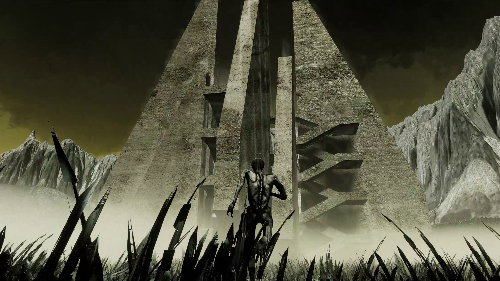
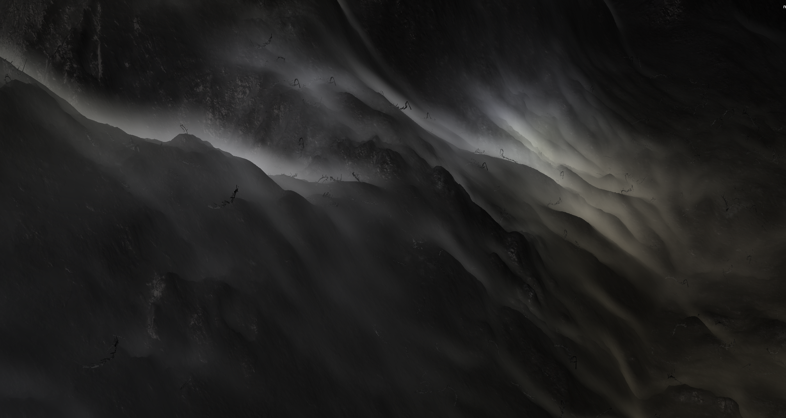

# Aggregate (2024)

An interpretation of the concepts of desire paths and machine learning in the shape of a third person open world video game.

_Video game, 3D print, installation_

By [Distraction Collective](https://distraction.fun) ([Jonathan Coryn](https://corjn.com/), [Nino Filiu](/), [Victor Meas](https://victormeas.com/) [Pierre Moulin](https://moulinpierre.com/), [Vincent Moulinet](https://vincentmoulinet.com/), [Camille Petit](https://kamyukami.com/), [alpha_rats](https://alpharats.com/)) and friends ([Igor Dubreucq](https://soundcloud.com/miguzo), [Jules Durand](https://julesdurand.com/), [Théo Le Du Fuentes](https://www.instagram.com/cosmografik/), [Moshe Linke](https://www.moshelinke.de/))

---

_Aggregate_ is an innovative art game that explores the concept of artificial intelligence learning to desire. Set in a vast, desolate landscape filled with electrical pylons, abandonned supermarkets, and post-sovietic superstructures, players take turns controlling a humanoid personnification of an AI as it painfully navigates through this wasteland.

The main game loop consists in the player having to walk long distances across thorn-ridden fields that quickly make them die out, but on respawn the paths traversed in previous lives are now safe to walk without losing health points. Across many iterations, the adversarial landscape slowly morphs into a network of walkable highways.

The more narratively explicit metaphor of the game is the exploration of gay cruising spots, but another metaphor of the unique locomotion mechanic is reinforcement learning, a technique used by machine learning models to learn new concepts through many iterations of trial and errors. The player is thus both a machine finding its way to be human, and a human finding its way to a lover.

The resin 3D printed gamepad displays countless thorns and spikes: designed to be uncomfortable to hold, its use creates a tangible connection between the player and the AI's struggles.

The project aims to provoke thought about the nature of desire, the role of AI in understanding human experiences, and the concept of "third landscape" - spaces that exist outside of traditional urban planning. It challenges players to reconsider abandoned spaces, the contingency of desire, and the subjectivity of algorithms in our contemporary world.

---

The game is far from a kit bash of pre-made assets, rather we spent a lot of time modeling and animating in-house the 3D models of the characters and buildings. Music and sound was also designed from the ground up, as well as the many scripts required to give life to the unique mechanics of the game. As a large open world taking more than an hour to fully explore that was built by people from wildly different background, it was both a technical and managerial challenge to pull off, but the game was ready with zero reported blocking bugs for its grand première at Octobre Numérique 2024.

---

[Play it here](https://distraction-collective.itch.io/aggregate) ([contact us](https://distraction.fun/) for the password)

Exhibited at [Octobre Numérique 2024](https://octobre-numerique.fr/)

Featured in [Usbek & Rika](https://usbeketrica.com/fr/article/le-permacomputing-ou-quand-la-permaculture-s-applique-a-l-informatique)

Featured in [Mouvement Magazine](https://www.mouvement.net/arts/octobre-numerique-a-arles-faire-monde-quand-tout-est-k-o)

Exhibited at [Me & Who?](https://www.instagram.com/p/DFXjW0tNOE1/), a group show by [Distraction Collective](https://distraction.fun/)

---