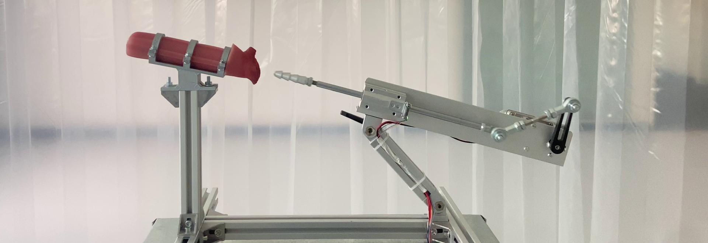

import vid from "../media/cum-as-you-are/vid.mov";

# Cum As You Are (2025)

**An installation by [Arvida Byström](https://www.instagram.com/arvidabystrom/) where a robot makes love to itself**

_Installation, Raspberry PI, repurposed sex machines, 3D print, sound design_

---

_« My off the shelf AI sex dolls pussy has sensors in it so when fucked with a long object it audibly "comes". Here it is doing the act with another equally inanimate object. I am so happy to finally have this produced since it been on my mind for a while. I think it is both cute and tender and it also says a lot about our ideas of pleasure which gets highlighted when taking out the human part of this usually object to human interaction. A huuuuge thanks to Nino Filiu who produced this and delt with the robotic and software parts of this beauty, such a smooth and nice production. »_ - [Arvida Byström](https://www.instagram.com/p/DJ9AYEbN0SS/)

  <video src={vid} autoplay muted loop playsinline controls />

---

Exhibited at [Never At Home](https://www.instagram.com/neverathome/) for the My Body Is A Temple show curated by [Carmen Lael Hines](https://www.instagram.com/carmen_lael_hines/) and [Clara Grillmaier](https://www.instagram.com/claragrillmaier/)

Installation by [Adam Sherman](https://www.instagram.com/__sherm__/)
