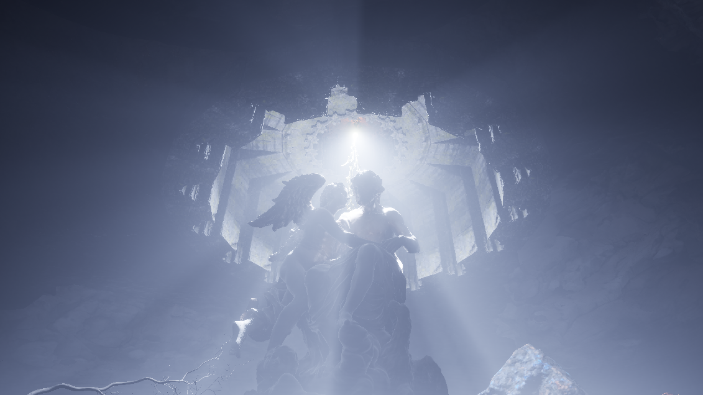

# Fideism (2026)

An experience questioning our assumptions about faith

_Virtual reality (PCVR), art game_

---

Fideism is an art game taking the shape of a pilgrimage through a virtual reality world.

This is where the story starts: at the bottom of a massive cave filled with serpentine vegetation and intricate rock formations. At its center stands a colossal statue, and above it, light shafts indicate a way out. On the cave walls, a mysterious symbol has been repeatedly engraved.

The player can move by grabbing onto branches and rocks and pulling themselves forward, sometimes akin to monkeys clinging their way up to tree lines, sometimes akin to lizards crawling along surfaces. This locomotion mechanic is unusual and distinctive, but also physically demanding, making the real-life player physically empathize with the sheer distances their virtual alter ego has to travel.

When the player finally reaches the exit of the cave, they are faced with a mountain crowned by two bone-like dead trees, giving meaning to the engraving found below. The player continues their long journey, always moving in the same direction: towards the light, towards higher ground, and, in a sense, towards being closer to God.

Upon reaching the summit, a god-like creature indeed emerges from the landscape, and performs a display of its surreal power by making massive boulders levitate high above the earth. But this display of surreal force is not a welcome, as this greater being promptly sends the rocks crashing down onto the player, crushing them and plunging the world into a death-like night. This is where the story ends.

Fideism is a game about faith, taking its name from the eponymous concept, which literally means "faith-ism" in Latin: a philosophical standpoint that holds that theological truths should not be sought through reason, but through faith alone.

But Fideism is a critique of said faith, most notably the judeo-christian leitmotiv that suffering makes one a good person. Why would God care about the monuments we raise for them? Why would they care about the length of our painful pilgrimage? Who are we to assume that reaching for the light, the summit of mountains, or fulfilling ancient prophecies written in stone have any meaning for greater beings? Why would God have more empathy for us than we have for ants?

