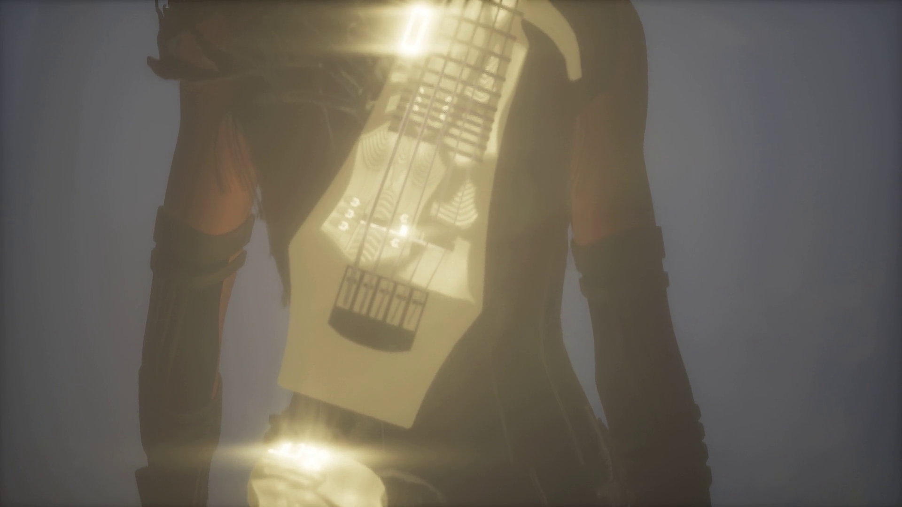
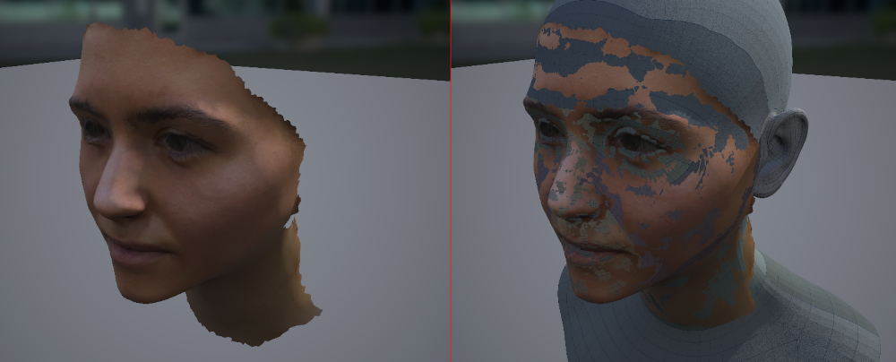
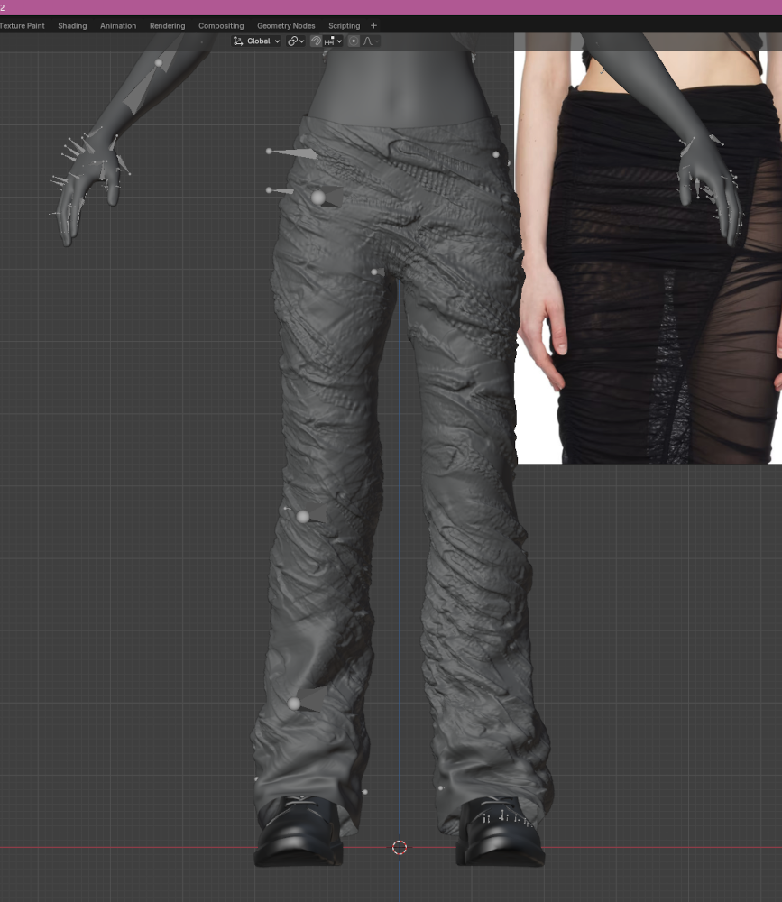
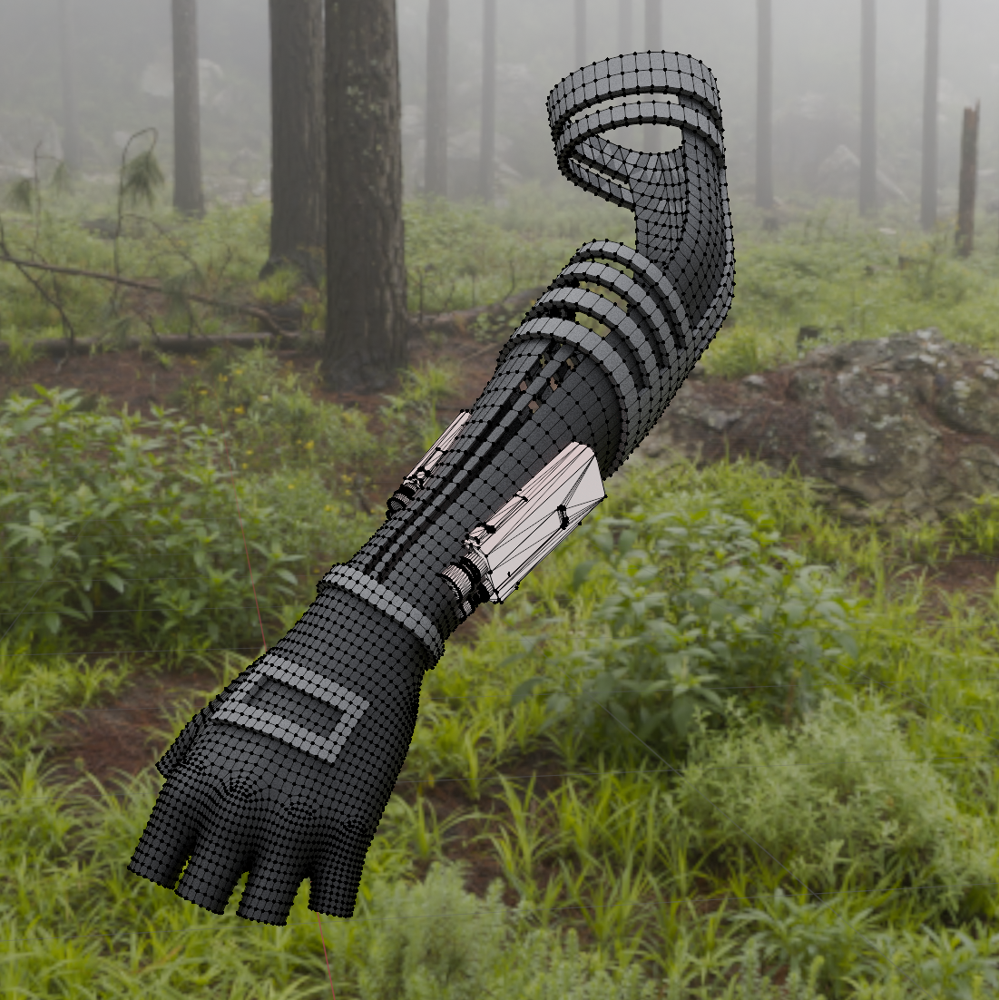
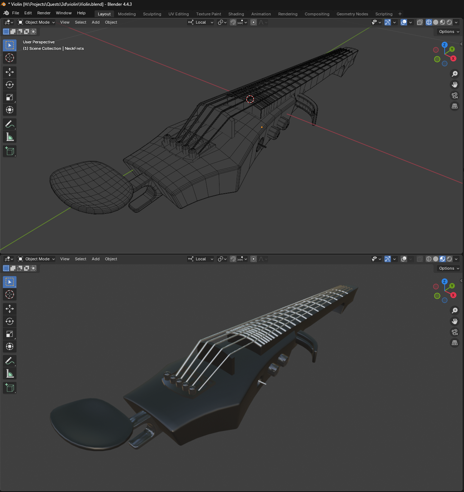
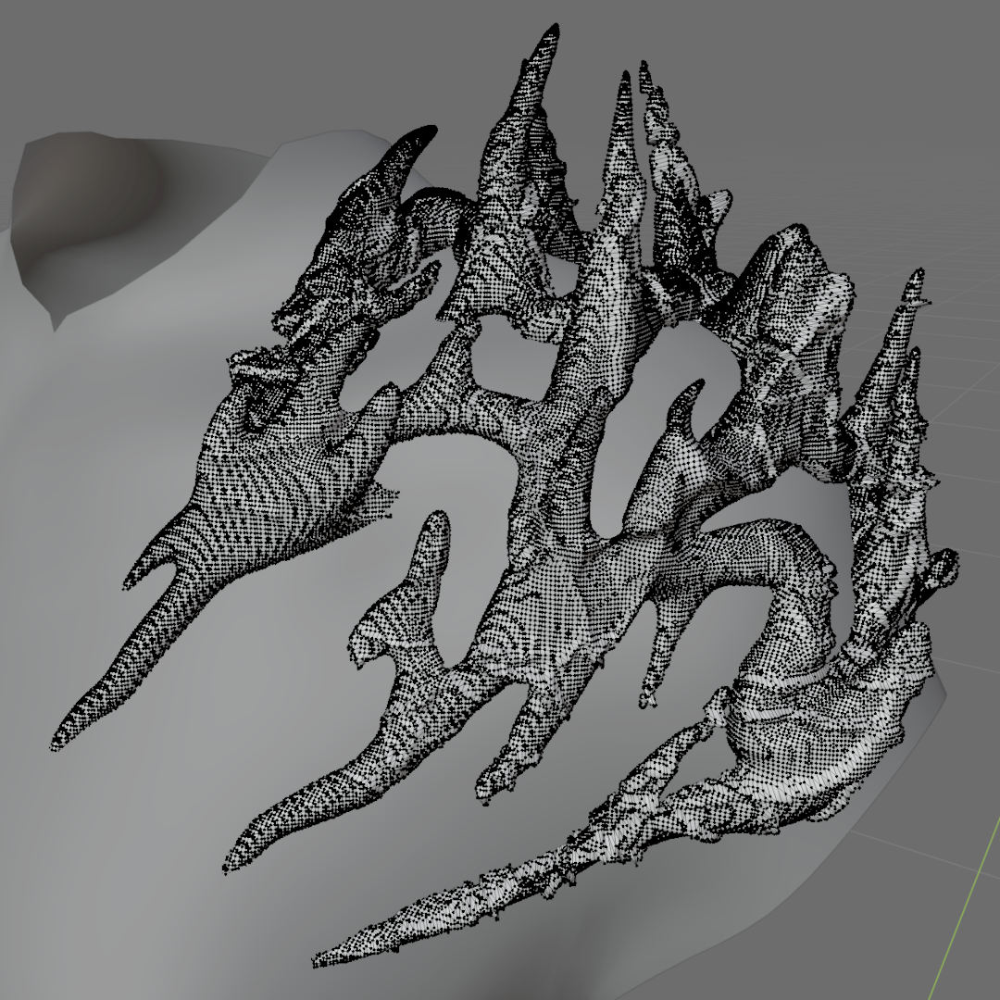

import IgPostQuests from "../components/IgPostQuests.astro";

# Quests (2025)

**Visuals for [Ines Cherifi](https://www.instagram.com/inescherifi__)'s EP. Art direction by [Mélanie Courtinat](https://melaniecourtinat.com/).**

_Unreal Engine, Metahuman, 3D fashion, 3D modelling, face scan_

---

As part of Ines Cherifi's EP release, Mélanie Courtinat and her imagined the artist walking in an mystical forest filled with lush god rays and tortuous trees.

I took it from there, starting by scanning Ines Cherifi's face with polycam and building a metahuman around it. The hair is not a base metahuman hair, it's a custom particle system built in blender.

There was a fair amount of 3D fashion design involved: pants and gloves where sculpted from scratch, the jacket was resculpted to fit Ines' body, and bespoke metal ornaments where created.

The electric violin at the heart of Cherifi's practice was not available online so I modelled it from scratch.

Finally the environment was made in Unreal Engine 5 which allowed from massive foliage amounts and real-time volumetric lighting.

<IgPostQuests />

---
