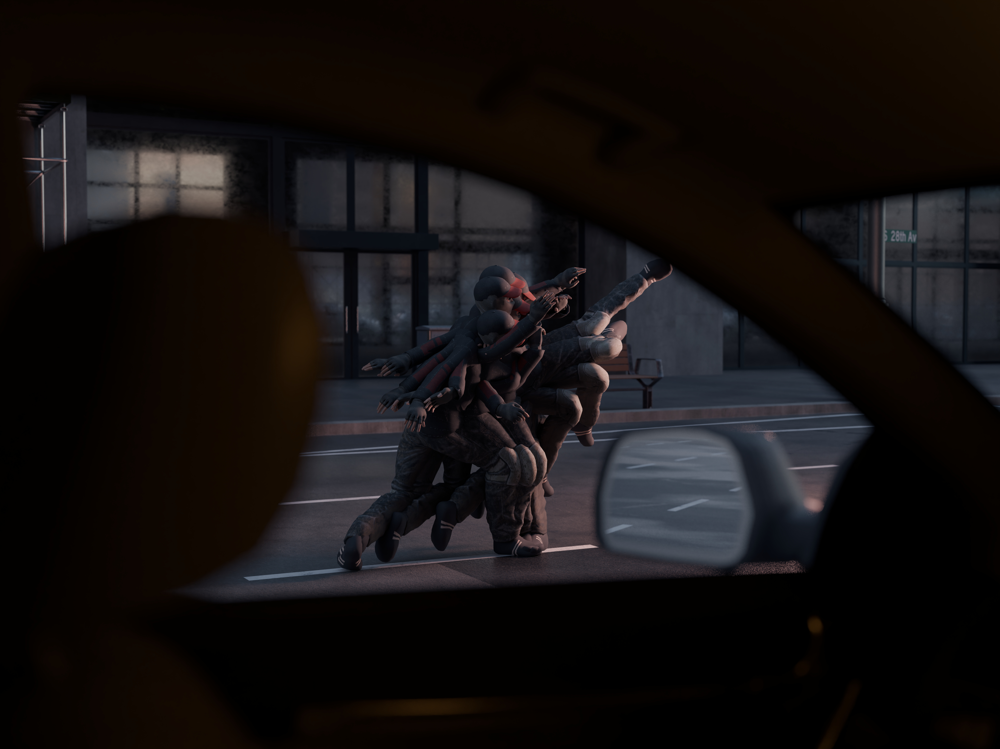
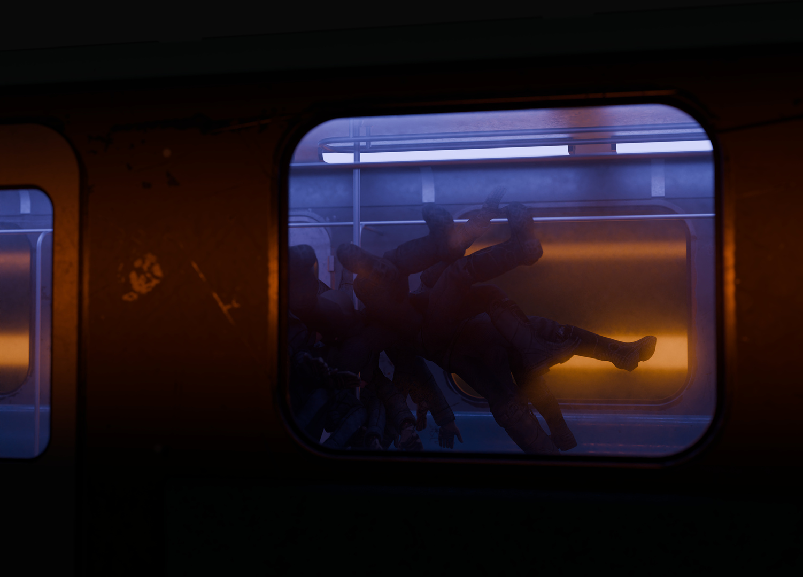

# Spark Plugs (2025)

**A series of 3D renders exploring ideas of urban supernaturality**

_Blender, prints, 53\*43cm_

---

In these pictures is explored the mundanity of moments of sudden realization of alive-ness, moments where, in the middle of a conventional day, in a boringly median daily walk, surrounding objects suddenly feel _more_, as if an otherwordly spectre passed by you, briefly illuminating your sentience plane, sparking a hastly moment of cognizance.

As a representation of the collide of two dimensions that only briefly cross, the series name _Spark Plugs_ is a deliberate amphiboly between the ordinary pieces of machinery and its meaning as in _dealers of sparks_.

---

Exhibited for Panoptes, a group show by Eclephsia, at Les Amarres

---

---
