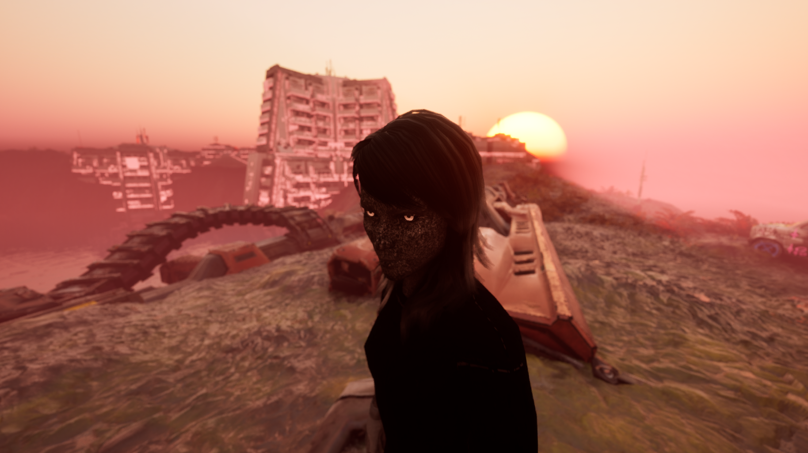

# Staggered (2025)

A playable poem exploring the shock state of accepting the death of the child self

_Video game_

Made in five days as part of [Residence Evil III](residenceevil.ch)

---

This year's theme of Residence Evil was _dusk_: in the context of the environment crisis, a possible WW3 around the corner, Gaza in flames, and the uncontrolled exponential growth of AI, it feels like civilization as we know it is on the brink of collapse - we're in a twilight zone, the last few livable decades before return of dark ages.

My interpretation of this pitch was to make a parrallel with the feeling of impending doom I felt when I came of age. Just like many of my teenage peers, I had suicidal tendencies coming from the conclusion that I was never going to be happy. I was bombarded with newly discovered harsh truths that violently pushed me out of childhood.

As theorized by german psychoanalyst Erik Erikson, this was a typical case of role confusion, in which a teenager mixes up accepting the symbolic death of its child self and actually dying. According to Carl Jung, such crisis are provoked by the act of running away from its shadow instead of facing hard truths.

The first part of the game is a direct retranscription of this psychological analysis of teenage distress: the player roams around a desolate landscape, constantly followed by a character that looks identical to them but with anthracite texture tones. Wherever the player goes, this shadow walks up to them. Upon contact, the screen flashes, a harsh designed sound effect plays, and a message takes up the whole screen.

_SOME WOUNDS NEVER HEAL_

_MY POTENTIAL IS LIMITED_

As the game progresses, these harsh messages become less like harsh truth to accept and more like ominous absurd screams.

_I WILL DIE MID SENTENCE_

_I SAW THE FACE OF GOD AND IT WAS WEEPING_

But at some point, the sun rises again. The shadow stops following you relentlessly, and a door opens up to a hidden part of the map. There, statues await you in the middle of a field of flowers. Upon contact, a "truth" still appear on screen, but this time exploring the concept of _ominous positivity_:

_I am not powerful enough to stop things from turning out fine_

_The sun does not need my permission to rise again_

This resolution goes beyond Jung and Erikson's framework for suicidal teenagers, but is more literal to my personal experience. In simple words, I was suicidal because I didn't know shit about life, and shit turned out fine. I didn't know moving out of my shitty middle school would make me have a happy high school. I didn't know I would find a passion for making art with computers. I didn't know I would meet like minded people with whom I ended up co-founding Distraction Collective and having amazing adventures together.

Likewise, I won't be able to explain on technical terms why I believe we'll survive the ongoing political crises, and I don't mean to say that things will resolve themselves by us just waiting by. I just have an innate faith in the strength of humanity and the power of life, and this video game is a testimony to that.

---
